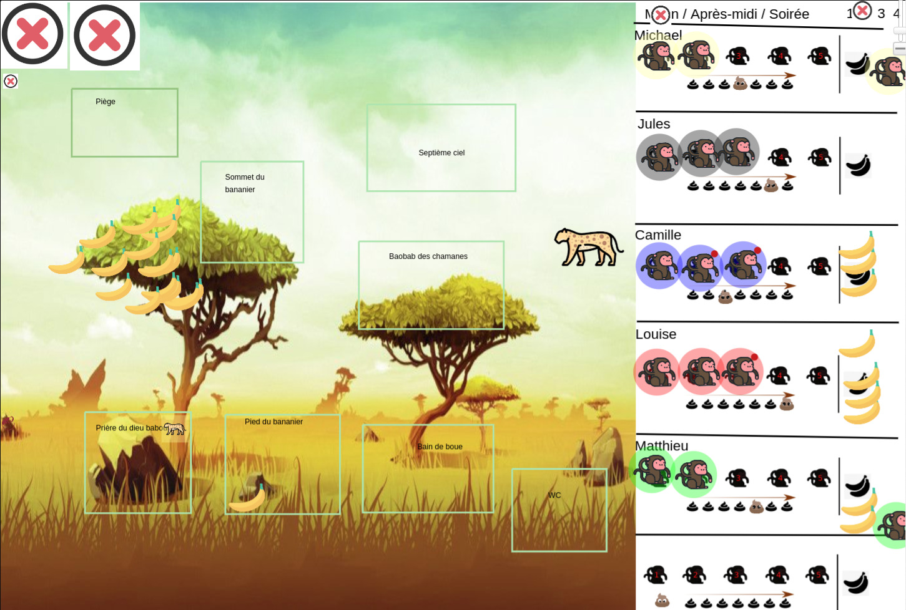

Board game for 3 to 5 players. In French.
Currently testing and iterating on the rules.

---

# MONKEYS
> Dans la savane, tous les singes vivent heureux. Nourrissez vos singes, gardez-les loin du léopard qui rôde et remportez la victoire en épouillant toute votre tribu !

Chaque journée de jeu se décompose en trois tours : matin, après-midi et soirée.

Chaque joueur commence sa partie avec deux singes non épouillés (des singes qui ont des poux) qu'il place sur sa zone de départ.

Un des joueurs est désigné aléatoirement premier joueur, le joueur à sa droite prend le jeton léopard.

## Déroulement d'un tour
À chaque tour, on indique en secret où chacun de ses singes va aller, et dans quel ordre.

Une fois que tous les joueurs sont prêts, le joueur qui a le jeton léopard place le léopard sur un des lieux : c'est son terrain de chasse pour le tour. Le léopard ne peut pas chasser deux tours de suite au même endroit.
On place une banane sur la case "pied du bananier".

On commence ensuite la phase de résolution : singe par singe, en commençant par le premier joueur puis en tournant dans le sens des aiguilles d'une montre.

Pour chaque singe :
* si le léopard se trouve sur le lieu où se rend le singe, le singe est dévoré ! Il ne réalise pas son action et est retiré du jeu. Le léopard, repu, rentre chez lui et quitte le lieu.
* si le léopard ne se trouve pas sur le lieu, le singe réalise l'action du lieu, puis rentre dans son habitat.

On réalise ainsi l'action de chaque singe. Lorsqu'un joueur n'a plus de singes à jouer, on passe son action jusqu'à ce que tous les singes de tous les joueurs aient été joués.

----
> Cas particulier : le dernier singe. Si un joueur n'a qu'un seul singe dans son habitat, ce singe est extrêmement prudent : si il rencontre le léopard, il ne se fait pas manger, et rentre simplement chez lui sans réaliser son action. Le léopard reste sur le lieu dans l'attente d'un potentiel futur repas...

----
> On ne peut pas passer. Les singes ont besoin d'air pur, et doivent tous se déplacer. Il est en revanche possible d'envoyer plusieurs de ses singes sur un même lieu.

### Lieux possibles
#### Au pied du bananier
Le singe récupère la moitié des bananes présentes sur le lieu, arrondi au supérieur (si il y a 5 bananes, il en ramène 3).

#### Au sommet du bananier
Le singe secoue le bananier, et fait tomber des bananes au pied du bananier. Lancez un dé 6 pour savoir combien de bananes tombent, puis ajoutez ces bananes à la réserve du lieu "pied du bananier".
Si le singe est le premier à faire cette action ce tour-ci, il récupère une banane.

#### Prière au dieu Babouin
Si des bananes sont présentes sur le lieu, le singe ramène toutes les bananes.
Si aucune banane n'est présente, le singe dessine sur les murs de la caverne du dieu Babouin. Ému, le dieu Babouin place 3 bananes dans la caverne pour le prochain visiteur.

#### Fosse d'aisance
Débarassez-vous de tous les jetons 💩 dans votre habitat.

#### 💕💕💕
Un nouveau petit singe vous rejoint ! Placez un singe de plus dans votre habitat, il pourra jouer dès le prochain tour.

#### Bain de boue
Si aucun singe n'est encore présent sur cette zone, laissez votre singe.
Si un singe est présent, le nouveau-venu l'épouille : le premier singe devient un singe épouillé (remplacez son jeton par un jeton épouillé), et le second est fier d'avoir aidé un ami singe (mais n'a rien)
Si un troisième singe arrive, *il n'épouille pas le second* : il attend juste qu'un quatrième arrive pour potentiellement l'épouiller, et l'on continue ainsi dans une logique épouilleur / épouillé.

> Note : un singe ne peut pas refuser d'épouiller un singe déjà présent. Les singes ne sont pas des gros égoïstes comme vous. Si un singe est déjà dans le bain de boue, même si il ne fait pas partie de la tribu du nouveau venu, il sera épouillé.
> Note : si un singe épouille un singe qui est déjà épouillé, rien ne se passe.

#### Piège !
Placer un marqueur "poux" sur un lieu. Le prochain singe épouillé qui s'aventurera sur ce lieu attrapera des poux !

#### Baobab des chamanes
Lorsque un singe pénètre dans le baobab des chamanes, on résout tout de suite les deux prochains singes de ce joueur.

#### Fin du tour
À la fin de chaque tour, chaque joueur prend autant de jetons 💩 qu'il a de singes dans son habitat. Si il n'y a pas assez de place pour placer tous les jetons, pour chaque jeton qui ne peut pas être placé, vous perdez une banane qui se périme dans cet environnement dégueulasse. Si vous n'avez pas de bananes à enlever, rien ne se passe.

Le premier joueur prend le jeton léopard, puis donne le jeton premier joueur au joueur à sa gauche.
On place une banane au pied du bananier et on enlève tous les jetons "poux" en jeu.

On déplace le jeton tour d'un cran (de matinée vers après-midi, etc.). Si le jeton était sur "soirée", on réalise les actions marquées en "fin de journée", sinon un nouveau tour commence.

## Fin de journée
Chaque joueur nourrit ses singes : pour cela, il enlève autant de bananes qu'il a de singes dans son habitat. S'il n'a pas assez de bananes pour nourrir tous ses singes, pour chaque tranche de deux bananes manquantes, un des singes abandonne son habitat (une ou deux bananes manquantes : un singe part, trois ou quatre bananes manquantes : deux singes, etc.)

Si, *après ces actions*, un joueur possède au moins trois singes, que tous ses singes sont épouillés, et qu'il a encore en réserve une banane par singe, il remporte la partie !

Sinon, une nouvelle journée commence.

-----
Une image du plateau de jeu utilisé pour faire les tests :)

